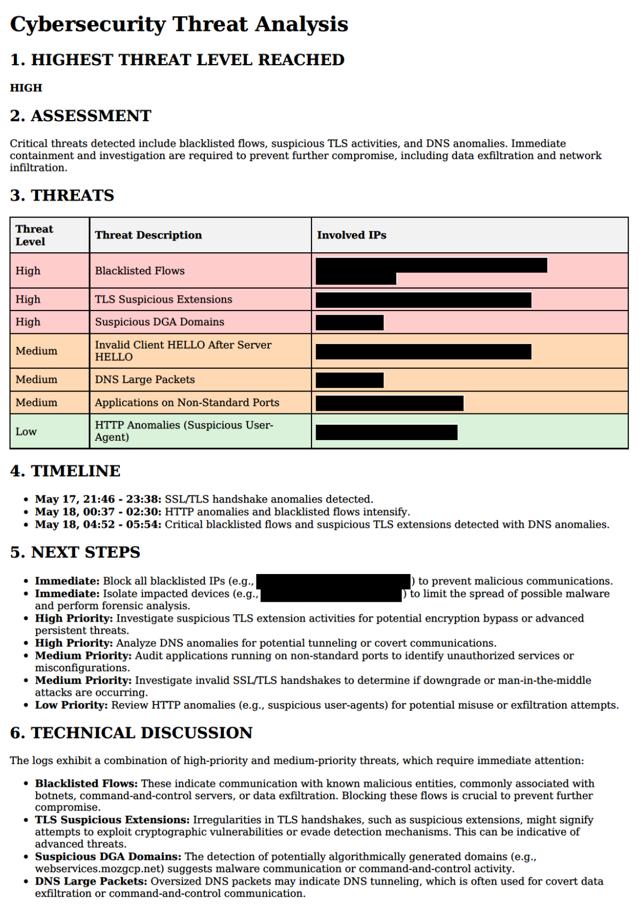

# LLM-powered-network-threat-monitor

Note: Documentation is slightly out of date and requires moderate overhaul.

AI-powered threat monitoring solution for home/SME networks, leveraging Snort, ntopng, pfSense, pfBlockerNG, and LLM analyses to detect, assess and take action in real time against malicious actors. Integrates automated blacklist generation and comprehensive threat intelligence reporting via a continuously updated webpage and persistent archiving of timestamped PDF reports.

## Features

- Local AI Snort and ntopng log ingestion, collation, analysis and IP blacklist generation to alert and address threats in real time
- Auto-blocking through regular pfSense pfBlockerNG pulls of autogenerated blacklists
- Facilitated auditing of IP blacklist via reputation lookups using the MXToolbox API
- Comprehensive and actionable webpage and PDF-based threat report generation

## Components

- `snort-monitor.sh` – Scans logs based on Snort update triggers, assesses threat level and risks, updates block lists, creates PDF reports, and hosts the alerting and blacklist webpages.
- `audit-consolidated-block-list.sh` – Allows auditing of current IP blocking for effectiveness, generating console summaries and an alternative  whitelist candidates
- `sample-report-*.pdf` – Sample (redacted) PDF threat report(s)
- Systemd unit ```snort-monitor.pub.service``` template for automation

## Usage

Manually run:

```bash
./snort-monitor.sh 
./audit-consolidated-block-list.sh [--redo-cache]
``` 
**Note:** ```snort-monitor.sh``` can be tested by running manually as shown above but should be run as a systemd unit in production.

**Important:** To ensure that all blocking behaviour is regularly quality checked by an actual human, please monitor and review LLM-generated website updates and PDF reports. Periodically audit automated blacklists using the MXToolbox API script (```audit-consolidated-block-list.sh```), updating the whitelist as required to address false positives.  The author bares no responsibility for undesirable impacts that lack of human oversight may produce.

## Output

- Locally hosted threat alert webpage
- Timestamped PDFs containing threat alerts, impact and risk assessments, prioritized "next step" checklists, and technical consideration notes
- Logged blacklist outputs, continuous aggregation/consolidation into a single blacklist, and cached JSON IP MXToolbox reputational reports



## Installation

1. Clone the repository:
   ```bash
   git clone https://github.com/ngpepin/LLM-powered-network-threat-monitor.git
   cd LLM-powered-network-threat-monitor
   ```

2. Ensure dependencies are installed:
   - `bash`, `curl`, `jq`, `whois`, `dig`, `systemd`
   - Python (for webpage hosting and PDF report generation)
   - OpenAI-compatible LLM chat completion API (local or cloud-based). Conversion to Ollama, etc., should not be challenging.
   
3. Configure the environment and test scripts manually before running as service.

## License

This project is licensed under the [MIT License](LICENSE).

---

**Author:** [ngpepin](https://github.com/ngpepin)
